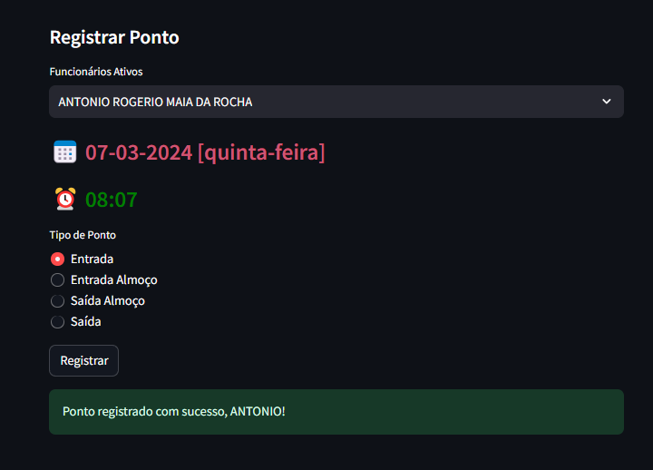
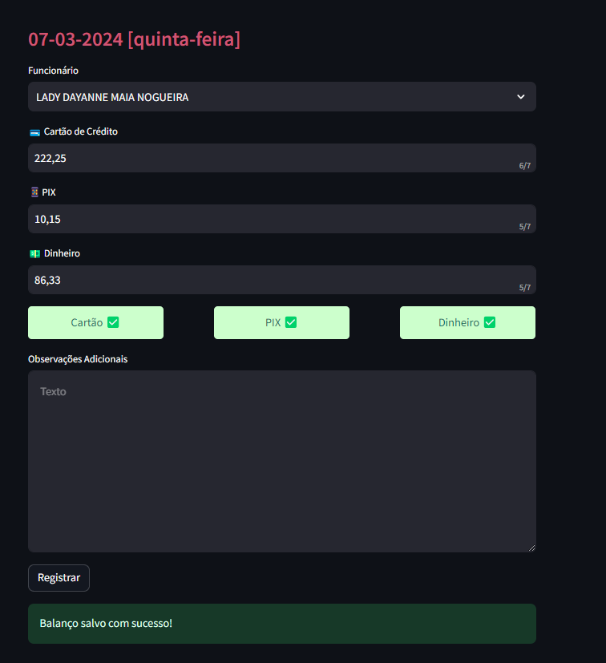
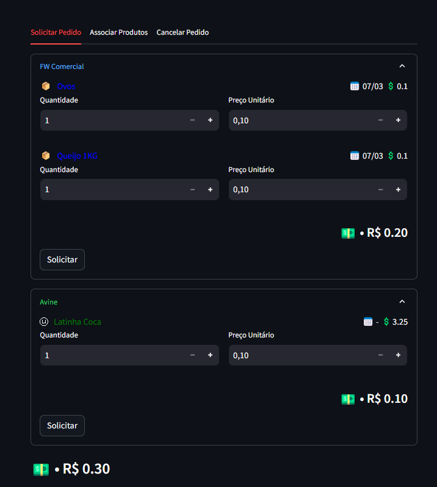

# 🍰 Bakery Management System

The Bakery Management System simplifies daily tasks, automates routines, and organizes data for better business management. It offers various modules to manage different aspects of daily operations.

## 📑 Modules

This project covers **4** modules:

1. 💼 **Employees** - Manage employee tasks such as registration, tracking, and status management.
2. 🕒 **Attendances** - Register, track, and monitor employees' work hours.
3. 💰 **Balance** - Monitor financial balances, cash flow, and generate financial reports.
4. 📦 **Stock Management** - Manage product inventory, including purchase orders, stock adjustments, and purchase recommendations.

## 💻 Technologies
- Linux
- Docker
- Streamlit
- Sqlite
- GitHub Actions
- Shell Scripting
- AWS S3

## ▶️ How To Execute

1. Clone the repository:
```bash
git clone https://github.com/oseliocandido/Bakery-System.git ~/myapp && cd ~/myapp
```

2. Configure the credentials:

   **Streamlit**

   Replace the credentials in `app/src/.streamlit/secrets.toml.example` with your own credentials.

   **AWS Backup**

   Replace the credentials in `env/aws.env.example` with your AWS credentials.


3. Open the terminal and run:
```bash
chmod +x startup.sh
./startup.sh
```

## 🖼️ Screenshots
### 👨‍💼 Attendance 


### 💰 Balance


### 🛒 Orders


## 📚 Features
### 🗃️ Backup 
Database backups are performed to AWS S3 using the service `backup` described in [docker-compose.yml](./docker-compose.yml):

```bash
# Get CURRENT_DATE to be used as part of key name on S3 bucket.
export DAY=$(date +"%d")
export MONTH=$(date +"%m")
export YEAR=$(date +"%Y")

# Start Backup Service
docker compose -f $HOME/myapp/docker-compose.yml up backup  >> $HOME/myapp/logs/aws-bck.log
```

### 🔄 Deploy 

GitHub Actions to automates Docker image deployment, performing the following steps:

1. Checks out the repository.
2. Build the new Dockerfile image and push it to Dockerhub as latest version.
3. Sets up SSH for deployment on the remote server.
4. Pull the latest Docker image, updating and restarting `streamlit` service.

### 🔐 Authentication / Authorization 
- Simple username/password verification described in the `authentication.py` module.
- The **View Layer** reruns for every user interaction verifying matching passwords.

### 📜 Logs
#### Controller Operations
- The `log.py` in the `utils` module contains a decorator function used to register controller functions calls, storing them in the SQLite3 `logs` table.

#### Database Operations
- Uses logger objects from the `logger.py` in the `logs` module to register errors defined in [PEP 249](https://peps.python.org/pep-0249/).


## ⚠️ Considerations 
-  Streamlit offers rapid development but may not be suitable for larger projects. It's best suited for smaller projects with moderate data needs, providing simplicity, ease of use and fast developemt.
- It's important to acknowledge its drawbacks since every user interaction causes the script top-down rerun of widgets. Leveraging frontend tools like React will mitigate this issue and enhance performance.

## 🛠️ Development Roadmap 
1. *Deployment on Linux* ✅
   * Lower infrastructure cost on cloud services

2. *Migration to Docker* ✅
   * Isolated enviroment and more portable across different plataforms

3. *Startup Script* ✅
   * Easier project configuration and execution through `startup.sh`file

4. *Continuous Delivery* ✅
   * Github Actions implementation, ensuring consistent code reliability and faster deployment cycles

5. *Database Replacement*
   * Migrate from SQLite to Postgres Container or Amazon RDS to ensure scalability and better performance as scales

6. *Decouple Frontend and Backend*
   * Developer FastAPI for backend development including authentication and frontend frameworks to properly separate responsibilities

7. *Secrets Management*
   * Use AWS Secrets Manager service to manage rotate database credentials, application credentials, OAuth tokens, API keys and other secrets.

8. *Log Migration to Cloud Services*
   * Migrate from local files to AWS CloudWatch for centralized log management

9. *Robust Authentication with OAuth2*
   * Implement OAuth2 authentication to strengthen security and reliability